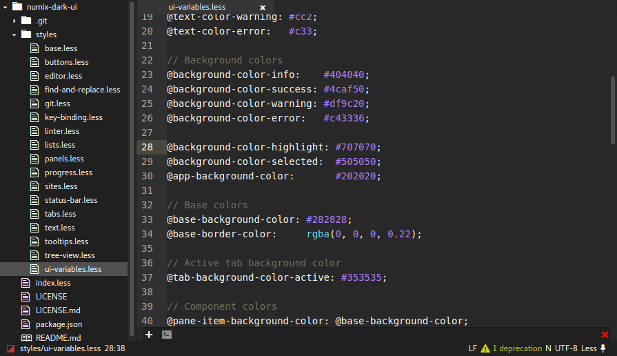

## Getting started

1. Fork this repository.
2. Continue with step 2 from [Creating an Interface Theme](https://atom.io/docs/v1.0.17/hacking-atom-creating-a-theme#creating-an-interface-theme)

If you get stuck somewhere, feel free to create an [issue](https://github.com/atom-community/ui-theme-template/issues/new).

ps. Don't forget to delete the above and edit the below in your own `README.md`.

---

## Numix Dark UI

This is a numix inspired theme changed to fit with night-time developers.
I stole the base theme from [tsbarnes](https://github.com/tsbarnes/numix-ui) and changed some colors.

